# PDL1 positivity, maximum 1%

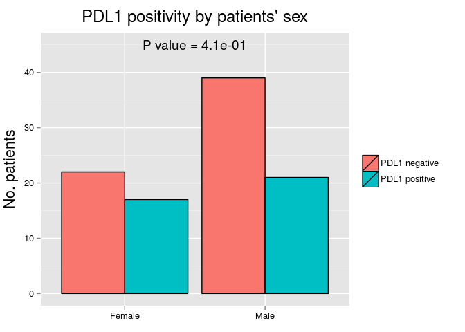 

|       | PDL1 negative |  %   | PDL1 positive |  %   |
|:------|:-------------:|:----:|:-------------:|:----:|
|Female |      22       | 36.1 |      17       | 44.7 |
|Male   |      39       | 63.9 |      21       | 55.3 |

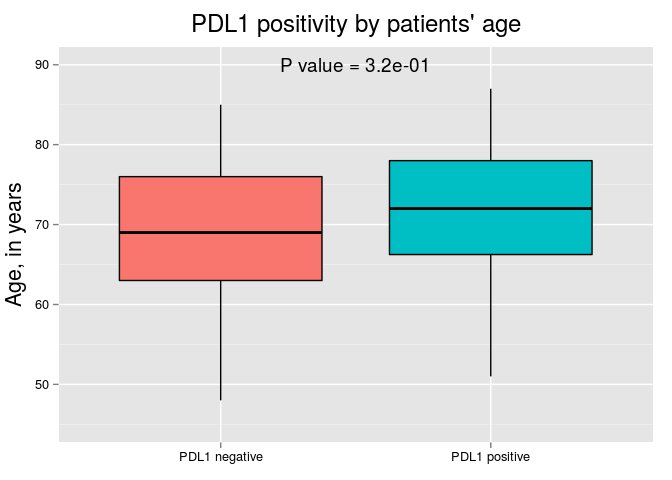 

|                    | PDL1 negative | PDL1 positive |
|:-------------------|:-------------:|:-------------:|
|Mean                |     69.1      |     71.3      |
|Standard Deviation  |      9.2      |      8.6      |
|Median              |     69.0      |     72.0      |
|Interquartile Range |     13.0      |     11.8      |
|Minimum             |     48.0      |     51.0      |
|Maximum             |     85.0      |     87.0      |

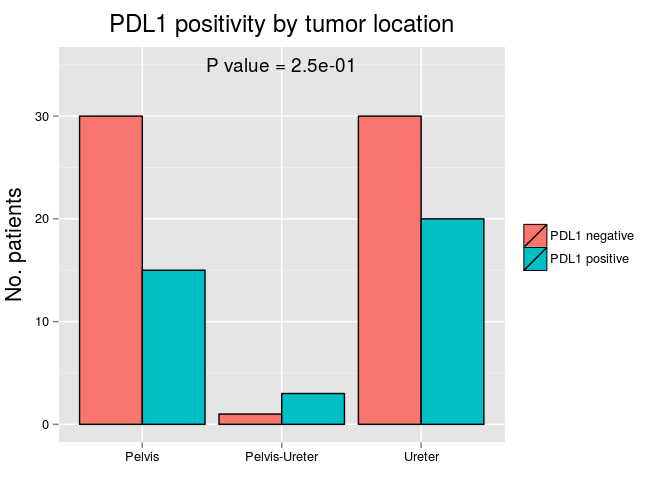 

|              | PDL1 negative |  %   | PDL1 positive |  %   |
|:-------------|:-------------:|:----:|:-------------:|:----:|
|Pelvis        |      30       | 49.2 |      15       | 39.5 |
|Pelvis-Ureter |       1       | 1.6  |       3       | 7.9  |
|Ureter        |      30       | 49.2 |      20       | 52.6 |

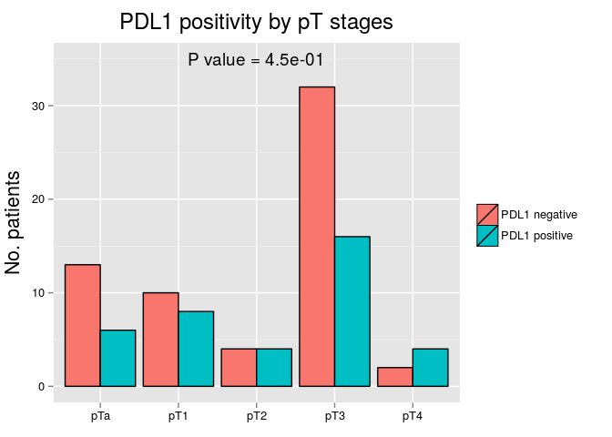 

|    | PDL1 negative |  %   | PDL1 positive |  %   |
|:---|:-------------:|:----:|:-------------:|:----:|
|pTa |      13       | 21.3 |       6       | 15.8 |
|pT1 |      10       | 16.4 |       8       | 21.1 |
|pT2 |       4       | 6.6  |       4       | 10.5 |
|pT3 |      32       | 52.5 |      16       | 42.1 |
|pT4 |       2       | 3.3  |       4       | 10.5 |

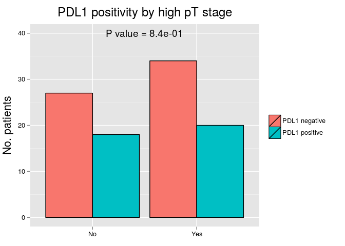 

|    | PDL1 negative |  %   | PDL1 positive |  %   |
|:---|:-------------:|:----:|:-------------:|:----:|
|No  |      27       | 44.3 |      18       | 47.4 |
|Yes |      34       | 55.7 |      20       | 52.6 |

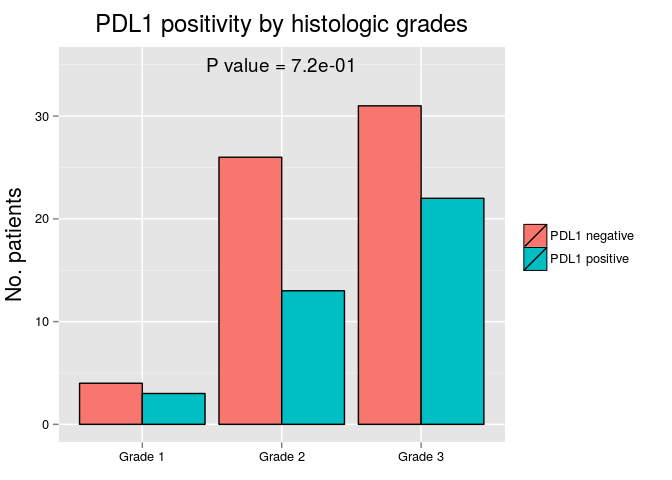 

|        | PDL1 negative |  %   | PDL1 positive |  %   |
|:-------|:-------------:|:----:|:-------------:|:----:|
|Grade 1 |       4       | 6.6  |       3       | 7.9  |
|Grade 2 |      26       | 42.6 |      13       | 34.2 |
|Grade 3 |      31       | 50.8 |      22       | 57.9 |

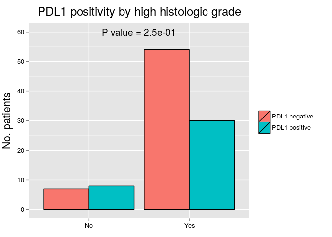 

|    | PDL1 negative |  %   | PDL1 positive |  %   |
|:---|:-------------:|:----:|:-------------:|:----:|
|No  |       7       | 11.5 |       8       | 21.1 |
|Yes |      54       | 88.5 |      30       | 78.9 |

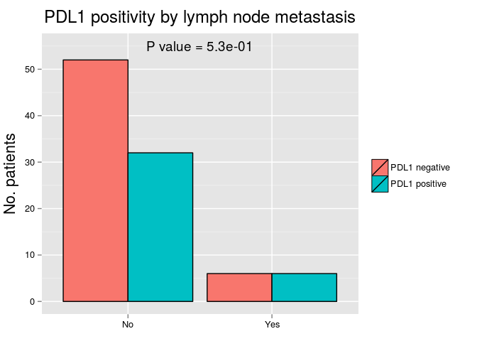 

|    | PDL1 negative |  %   | PDL1 positive |  %   |
|:---|:-------------:|:----:|:-------------:|:----:|
|No  |      52       | 89.7 |      32       | 84.2 |
|Yes |       6       | 10.3 |       6       | 15.8 |

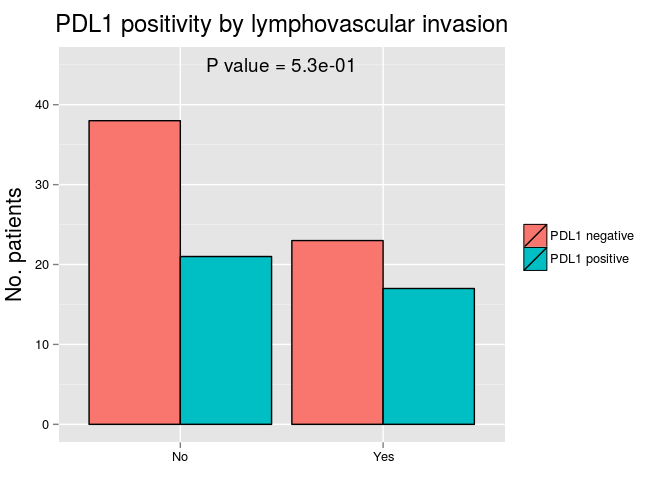 

|    | PDL1 negative |  %   | PDL1 positive |  %   |
|:---|:-------------:|:----:|:-------------:|:----:|
|No  |      38       | 62.3 |      21       | 55.3 |
|Yes |      23       | 37.7 |      17       | 44.7 |

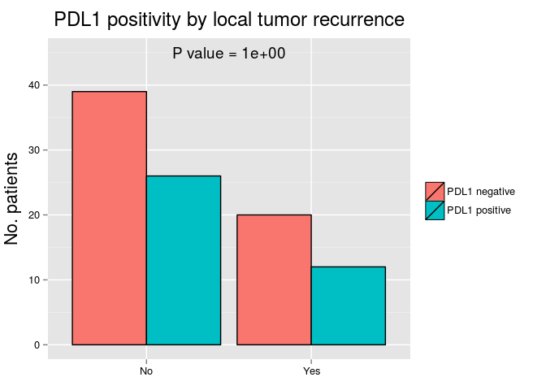 

|    | PDL1 negative |  %   | PDL1 positive |  %   |
|:---|:-------------:|:----:|:-------------:|:----:|
|No  |      39       | 66.1 |      26       | 68.4 |
|Yes |      20       | 33.9 |      12       | 31.6 |

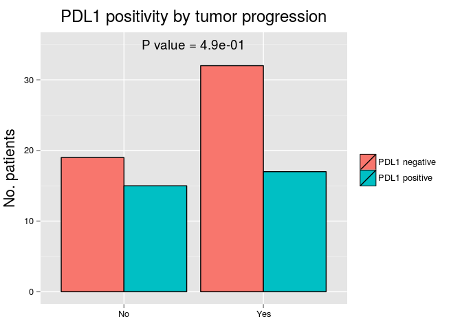 

|    | PDL1 negative |  %   | PDL1 positive |  %   |
|:---|:-------------:|:----:|:-------------:|:----:|
|No  |      19       | 37.3 |      15       | 46.9 |
|Yes |      32       | 62.7 |      17       | 53.1 |

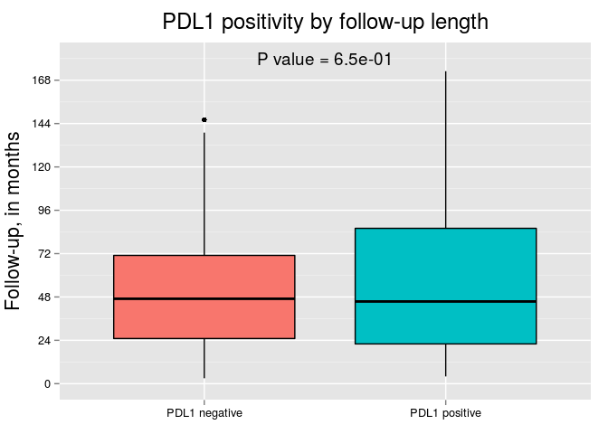 

|                    | PDL1 negative | PDL1 positive |
|:-------------------|:-------------:|:-------------:|
|Mean                |     53.0      |     57.8      |
|Standard Deviation  |     38.3      |     42.8      |
|Median              |     47.0      |     45.5      |
|Interquartile Range |     46.0      |     64.0      |
|Minimum             |      3.0      |      4.0      |
|Maximum             |     146.0     |     173.0     |

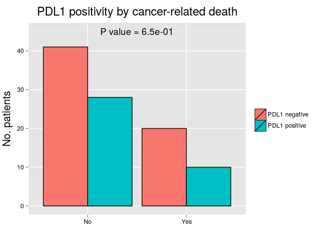 

|    | PDL1 negative |  %   | PDL1 positive |  %   |
|:---|:-------------:|:----:|:-------------:|:----:|
|No  |      41       | 67.2 |      28       | 73.7 |
|Yes |      20       | 32.8 |      10       | 26.3 |

 

# Odds ratios for local tumor recurrence

|Variables                         |  OR   | Lower 95% CI | Higher 95% CI | P value |
|:---------------------------------|:-----:|:------------:|:-------------:|:-------:|
|Patient's sex                     | 1.45  |     0.60     |     3.66      |  0.42   |
|Patient's age group               | 0.97  |     0.41     |     2.30      |  0.95   |
|Tumor location (pelvis vs ureter) | 1.16  |     0.48     |     2.82      |  0.74   |
|High pT (>pT2) stage              | 23.15 |     6.25     |    150.95     | 4.8e-05 |
|High histologic grade             | 7.38  |     1.38     |    137.08     |  0.059  |
|Lymph node metastasis             | 3.71  |     1.08     |     13.69     |  0.039  |
|Lymphovascular invasion           | 7.79  |     3.06     |     21.66     | 3.4e-05 |
|PDL1 positivity                   | 0.73  |     0.29     |     1.77      |   0.5   |

# Odds ratios for tumor progression

|Variables                         |  OR   | Lower 95% CI | Higher 95% CI | P value |
|:---------------------------------|:-----:|:------------:|:-------------:|:-------:|
|Patient's sex                     | 0.83  |     0.33     |     2.01      |  0.67   |
|Patient's age group               | 0.50  |     0.20     |     1.22      |  0.13   |
|Tumor location (pelvis vs ureter) | 1.14  |     0.47     |     2.76      |  0.78   |
|High pT (>pT2) stage              | 5.23  |     2.07     |     13.97     | 0.00064 |
|High histologic grade             | 3e+08 |   9.7e-40    |      NA       |  0.99   |
|Lymph node metastasis             | 3.12  |     0.72     |     21.65     |  0.17   |
|Lymphovascular invasion           | 3.99  |     1.56     |     11.06     | 0.0053  |
|PDL1 positivity                   | 0.67  |     0.27     |     1.65      |  0.39   |

# Odds ratios for cancer-related death

|Variables                         |  OR   | Lower 95% CI | Higher 95% CI | P value |
|:---------------------------------|:-----:|:------------:|:-------------:|:-------:|
|Patient's sex                     | 1.45  |     0.60     |     3.66      |  0.42   |
|Patient's age group               | 0.97  |     0.41     |     2.30      |  0.95   |
|Tumor location (pelvis vs ureter) | 1.16  |     0.48     |     2.82      |  0.74   |
|High pT (>pT2) stage              | 23.15 |     6.25     |    150.95     | 4.8e-05 |
|High histologic grade             | 7.38  |     1.38     |    137.08     |  0.059  |
|Lymph node metastasis             | 3.71  |     1.08     |     13.69     |  0.039  |
|Lymphovascular invasion           | 7.79  |     3.06     |     21.66     | 3.4e-05 |
|PDL1 positivity                   | 0.73  |     0.29     |     1.77      |   0.5   |

# Hazard ratios for cancer-related death

|Variables                         |  HR   | Lower 95% CI | Higher 95% CI | P value |
|:---------------------------------|:-----:|:------------:|:-------------:|:-------:|
|Patient's sex                     | 1.33  |     0.75     |     0.62      |  0.45   |
|Patient's age group               | 0.77  |     1.29     |     0.37      |  0.49   |
|Tumor location (pelvis vs ureter) | 1.21  |     0.82     |     0.58      |   0.6   |
|High pT (>pT2) stage              | 17.63 |    0.057     |     4.19      | 1.1e-08 |
|High histologic grade             | 7.79  |     0.13     |     1.06      | 0.0045  |
|Lymph node metastasis             | 2.76  |     0.36     |     1.18      |  0.033  |
|Lymphovascular invasion           | 5.64  |     0.18     |     2.50      | 6.1e-06 |
|PDL1 positivity                   | 0.76  |     1.31     |     0.36      |  0.48   |

