# PDL1 positivity, median 1%

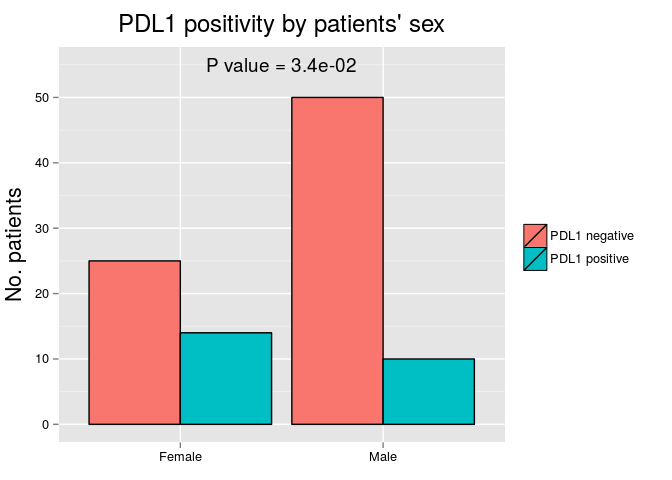 

|       | PDL1 negative |  %   | PDL1 positive |  %   |
|:------|:-------------:|:----:|:-------------:|:----:|
|Female |      25       | 33.3 |      14       | 58.3 |
|Male   |      50       | 66.7 |      10       | 41.7 |

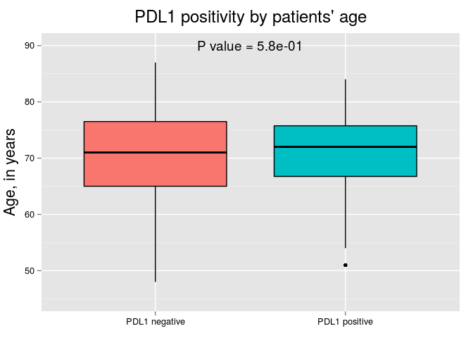 

|                    | PDL1 negative | PDL1 positive |
|:-------------------|:-------------:|:-------------:|
|Mean                |     69.7      |     70.9      |
|Standard Deviation  |      9.0      |      8.8      |
|Median              |     71.0      |     72.0      |
|Interquartile Range |     11.5      |      9.0      |
|Minimum             |     48.0      |     51.0      |
|Maximum             |     87.0      |     84.0      |

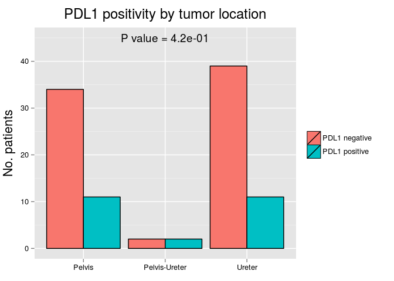 

|              | PDL1 negative |  %   | PDL1 positive |  %   |
|:-------------|:-------------:|:----:|:-------------:|:----:|
|Pelvis        |      34       | 45.3 |      11       | 45.8 |
|Pelvis-Ureter |       2       | 2.7  |       2       | 8.3  |
|Ureter        |      39       | 52.0 |      11       | 45.8 |

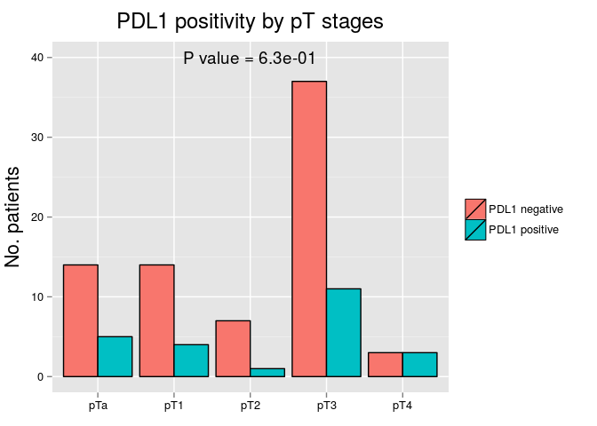 

|    | PDL1 negative |  %   | PDL1 positive |  %   |
|:---|:-------------:|:----:|:-------------:|:----:|
|pTa |      14       | 18.7 |       5       | 20.8 |
|pT1 |      14       | 18.7 |       4       | 16.7 |
|pT2 |       7       | 9.3  |       1       | 4.2  |
|pT3 |      37       | 49.3 |      11       | 45.8 |
|pT4 |       3       | 4.0  |       3       | 12.5 |

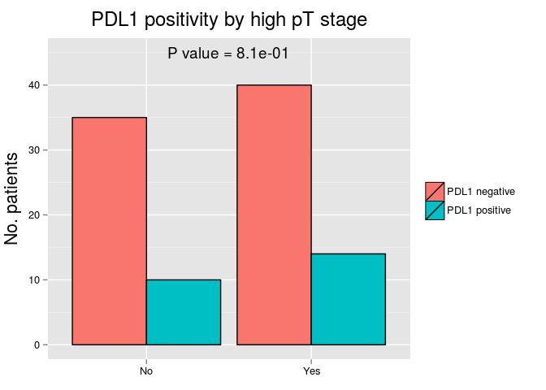 

|    | PDL1 negative |  %   | PDL1 positive |  %   |
|:---|:-------------:|:----:|:-------------:|:----:|
|No  |      35       | 46.7 |      10       | 41.7 |
|Yes |      40       | 53.3 |      14       | 58.3 |

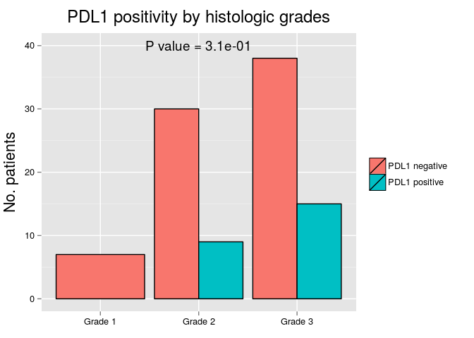 

|        | PDL1 negative |  %   | PDL1 positive |  %   |
|:-------|:-------------:|:----:|:-------------:|:----:|
|Grade 1 |       7       | 9.3  |       0       | 0.0  |
|Grade 2 |      30       | 40.0 |       9       | 37.5 |
|Grade 3 |      38       | 50.7 |      15       | 62.5 |

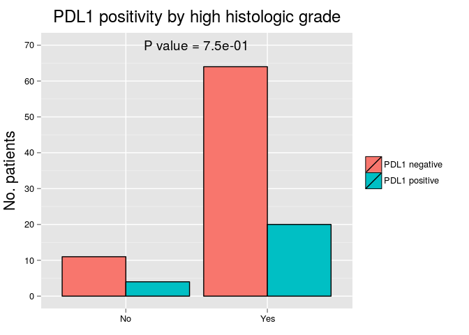 

|    | PDL1 negative |  %   | PDL1 positive |  %   |
|:---|:-------------:|:----:|:-------------:|:----:|
|No  |      11       | 14.7 |       4       | 16.7 |
|Yes |      64       | 85.3 |      20       | 83.3 |

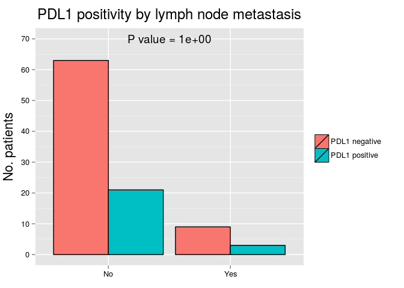 

|    | PDL1 negative |  %   | PDL1 positive |  %   |
|:---|:-------------:|:----:|:-------------:|:----:|
|No  |      63       | 87.5 |      21       | 87.5 |
|Yes |       9       | 12.5 |       3       | 12.5 |

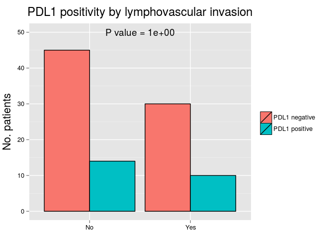 

|    | PDL1 negative | %  | PDL1 positive |  %   |
|:---|:-------------:|:--:|:-------------:|:----:|
|No  |      45       | 60 |      14       | 58.3 |
|Yes |      30       | 40 |      10       | 41.7 |

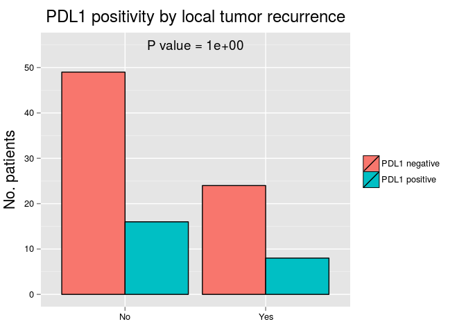 

|    | PDL1 negative |  %   | PDL1 positive |  %   |
|:---|:-------------:|:----:|:-------------:|:----:|
|No  |      49       | 67.1 |      16       | 66.7 |
|Yes |      24       | 32.9 |       8       | 33.3 |

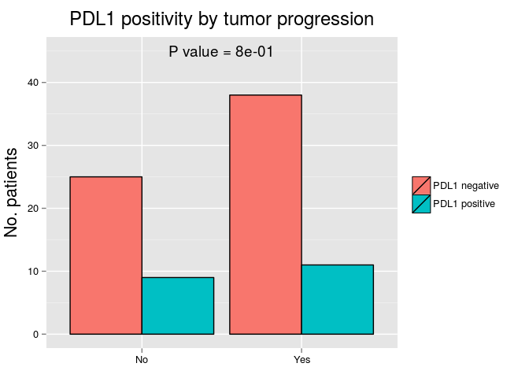 

|    | PDL1 negative |  %   | PDL1 positive | %  |
|:---|:-------------:|:----:|:-------------:|:--:|
|No  |      25       | 39.7 |       9       | 45 |
|Yes |      38       | 60.3 |      11       | 55 |

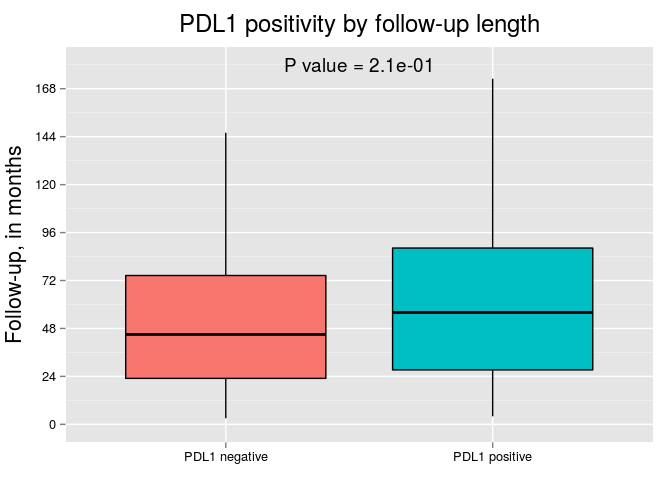 

|                    | PDL1 negative | PDL1 positive |
|:-------------------|:-------------:|:-------------:|
|Mean                |     51.8      |     64.2      |
|Standard Deviation  |     37.9      |     45.3      |
|Median              |     45.0      |     56.0      |
|Interquartile Range |     51.5      |     61.0      |
|Minimum             |      3.0      |      4.0      |
|Maximum             |     146.0     |     173.0     |

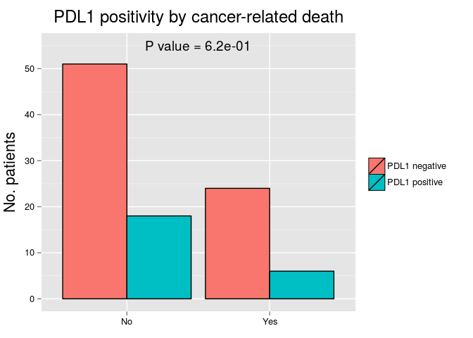 

|    | PDL1 negative | %  | PDL1 positive | %  |
|:---|:-------------:|:--:|:-------------:|:--:|
|No  |      51       | 68 |      18       | 75 |
|Yes |      24       | 32 |       6       | 25 |

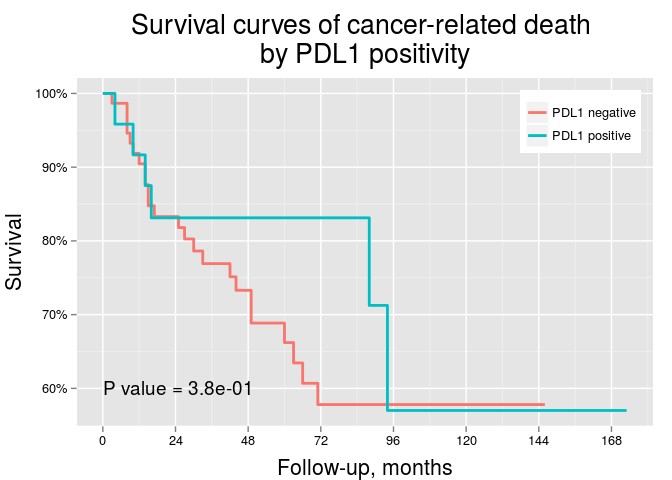 

