# PDL1 positivity, maximum 5%

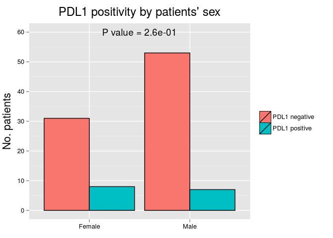 <table>
 <thead>
  <tr>
   <th style="text-align:left;">   </th>
   <th style="text-align:center;"> PDL1 negative </th>
   <th style="text-align:center;"> % </th>
   <th style="text-align:center;"> PDL1 positive </th>
   <th style="text-align:center;"> % </th>
  </tr>
 </thead>
<tbody>
  <tr>
   <td style="text-align:left;"> Female </td>
   <td style="text-align:center;"> 31 </td>
   <td style="text-align:center;"> 36.9 </td>
   <td style="text-align:center;"> 8 </td>
   <td style="text-align:center;"> 53.3 </td>
  </tr>
  <tr>
   <td style="text-align:left;"> Male </td>
   <td style="text-align:center;"> 53 </td>
   <td style="text-align:center;"> 63.1 </td>
   <td style="text-align:center;"> 7 </td>
   <td style="text-align:center;"> 46.7 </td>
  </tr>
</tbody>
</table>

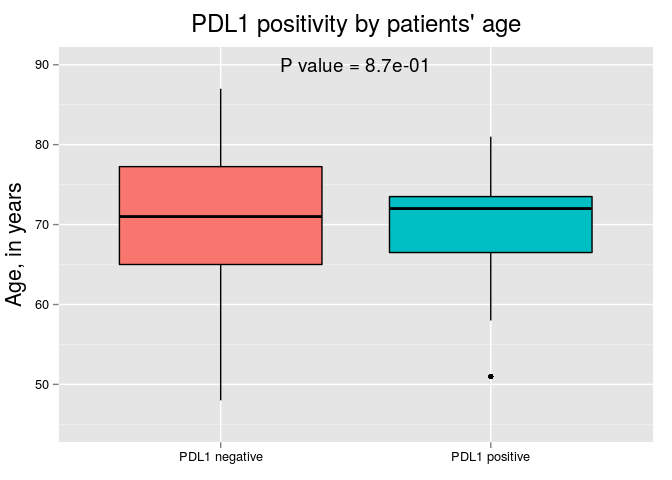 <table>
 <thead>
  <tr>
   <th style="text-align:left;">   </th>
   <th style="text-align:center;"> PDL1 negative </th>
   <th style="text-align:center;"> PDL1 positive </th>
  </tr>
 </thead>
<tbody>
  <tr>
   <td style="text-align:left;"> Mean </td>
   <td style="text-align:center;"> 70.0 </td>
   <td style="text-align:center;"> 69.9 </td>
  </tr>
  <tr>
   <td style="text-align:left;"> Standard Deviation </td>
   <td style="text-align:center;"> 9.2 </td>
   <td style="text-align:center;"> 7.8 </td>
  </tr>
  <tr>
   <td style="text-align:left;"> Median </td>
   <td style="text-align:center;"> 71.0 </td>
   <td style="text-align:center;"> 72.0 </td>
  </tr>
  <tr>
   <td style="text-align:left;"> Interquartile Range </td>
   <td style="text-align:center;"> 12.2 </td>
   <td style="text-align:center;"> 7.0 </td>
  </tr>
  <tr>
   <td style="text-align:left;"> Minimum </td>
   <td style="text-align:center;"> 48.0 </td>
   <td style="text-align:center;"> 51.0 </td>
  </tr>
  <tr>
   <td style="text-align:left;"> Maximum </td>
   <td style="text-align:center;"> 87.0 </td>
   <td style="text-align:center;"> 81.0 </td>
  </tr>
</tbody>
</table>

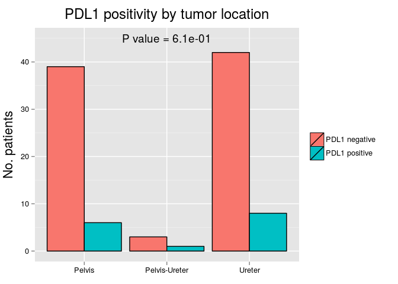 <table>
 <thead>
  <tr>
   <th style="text-align:left;">   </th>
   <th style="text-align:center;"> PDL1 negative </th>
   <th style="text-align:center;"> % </th>
   <th style="text-align:center;"> PDL1 positive </th>
   <th style="text-align:center;"> % </th>
  </tr>
 </thead>
<tbody>
  <tr>
   <td style="text-align:left;"> Pelvis </td>
   <td style="text-align:center;"> 39 </td>
   <td style="text-align:center;"> 46.4 </td>
   <td style="text-align:center;"> 6 </td>
   <td style="text-align:center;"> 40.0 </td>
  </tr>
  <tr>
   <td style="text-align:left;"> Pelvis-Ureter </td>
   <td style="text-align:center;"> 3 </td>
   <td style="text-align:center;"> 3.6 </td>
   <td style="text-align:center;"> 1 </td>
   <td style="text-align:center;"> 6.7 </td>
  </tr>
  <tr>
   <td style="text-align:left;"> Ureter </td>
   <td style="text-align:center;"> 42 </td>
   <td style="text-align:center;"> 50.0 </td>
   <td style="text-align:center;"> 8 </td>
   <td style="text-align:center;"> 53.3 </td>
  </tr>
</tbody>
</table>

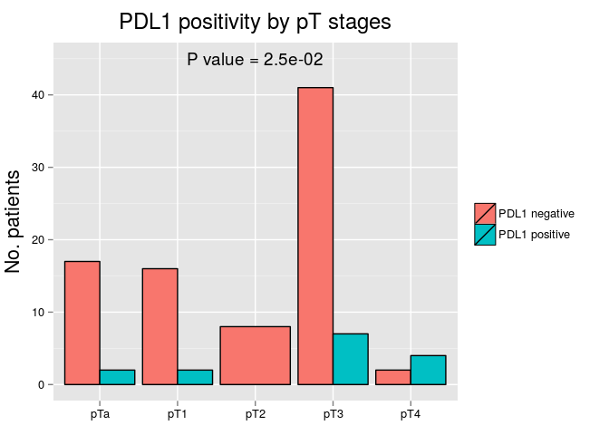 <table>
 <thead>
  <tr>
   <th style="text-align:left;">   </th>
   <th style="text-align:center;"> PDL1 negative </th>
   <th style="text-align:center;"> % </th>
   <th style="text-align:center;"> PDL1 positive </th>
   <th style="text-align:center;"> % </th>
  </tr>
 </thead>
<tbody>
  <tr>
   <td style="text-align:left;"> pTa </td>
   <td style="text-align:center;"> 17 </td>
   <td style="text-align:center;"> 20.2 </td>
   <td style="text-align:center;"> 2 </td>
   <td style="text-align:center;"> 13.3 </td>
  </tr>
  <tr>
   <td style="text-align:left;"> pT1 </td>
   <td style="text-align:center;"> 16 </td>
   <td style="text-align:center;"> 19.0 </td>
   <td style="text-align:center;"> 2 </td>
   <td style="text-align:center;"> 13.3 </td>
  </tr>
  <tr>
   <td style="text-align:left;"> pT2 </td>
   <td style="text-align:center;"> 8 </td>
   <td style="text-align:center;"> 9.5 </td>
   <td style="text-align:center;"> 0 </td>
   <td style="text-align:center;"> 0.0 </td>
  </tr>
  <tr>
   <td style="text-align:left;"> pT3 </td>
   <td style="text-align:center;"> 41 </td>
   <td style="text-align:center;"> 48.8 </td>
   <td style="text-align:center;"> 7 </td>
   <td style="text-align:center;"> 46.7 </td>
  </tr>
  <tr>
   <td style="text-align:left;"> pT4 </td>
   <td style="text-align:center;"> 2 </td>
   <td style="text-align:center;"> 2.4 </td>
   <td style="text-align:center;"> 4 </td>
   <td style="text-align:center;"> 26.7 </td>
  </tr>
</tbody>
</table>

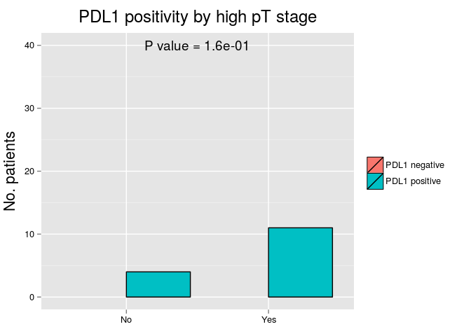 <table>
 <thead>
  <tr>
   <th style="text-align:left;">   </th>
   <th style="text-align:center;"> PDL1 negative </th>
   <th style="text-align:center;"> % </th>
   <th style="text-align:center;"> PDL1 positive </th>
   <th style="text-align:center;"> % </th>
  </tr>
 </thead>
<tbody>
  <tr>
   <td style="text-align:left;"> No </td>
   <td style="text-align:center;"> 41 </td>
   <td style="text-align:center;"> 48.8 </td>
   <td style="text-align:center;"> 4 </td>
   <td style="text-align:center;"> 26.7 </td>
  </tr>
  <tr>
   <td style="text-align:left;"> Yes </td>
   <td style="text-align:center;"> 43 </td>
   <td style="text-align:center;"> 51.2 </td>
   <td style="text-align:center;"> 11 </td>
   <td style="text-align:center;"> 73.3 </td>
  </tr>
</tbody>
</table>

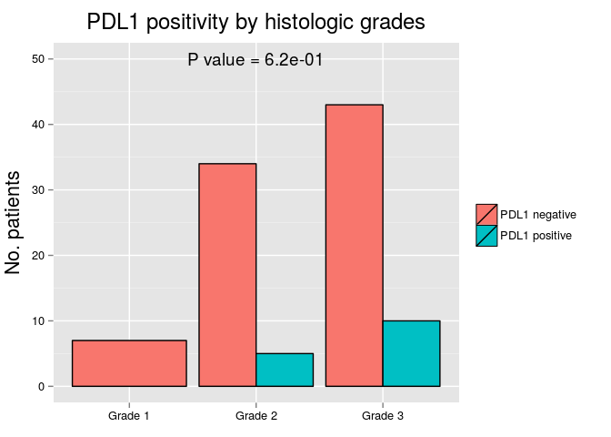 <table>
 <thead>
  <tr>
   <th style="text-align:left;">   </th>
   <th style="text-align:center;"> PDL1 negative </th>
   <th style="text-align:center;"> % </th>
   <th style="text-align:center;"> PDL1 positive </th>
   <th style="text-align:center;"> % </th>
  </tr>
 </thead>
<tbody>
  <tr>
   <td style="text-align:left;"> Grade 1 </td>
   <td style="text-align:center;"> 7 </td>
   <td style="text-align:center;"> 8.3 </td>
   <td style="text-align:center;"> 0 </td>
   <td style="text-align:center;"> 0.0 </td>
  </tr>
  <tr>
   <td style="text-align:left;"> Grade 2 </td>
   <td style="text-align:center;"> 34 </td>
   <td style="text-align:center;"> 40.5 </td>
   <td style="text-align:center;"> 5 </td>
   <td style="text-align:center;"> 33.3 </td>
  </tr>
  <tr>
   <td style="text-align:left;"> Grade 3 </td>
   <td style="text-align:center;"> 43 </td>
   <td style="text-align:center;"> 51.2 </td>
   <td style="text-align:center;"> 10 </td>
   <td style="text-align:center;"> 66.7 </td>
  </tr>
</tbody>
</table>

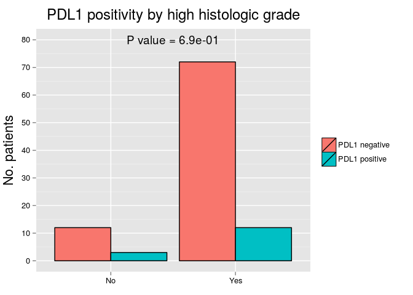 <table>
 <thead>
  <tr>
   <th style="text-align:left;">   </th>
   <th style="text-align:center;"> PDL1 negative </th>
   <th style="text-align:center;"> % </th>
   <th style="text-align:center;"> PDL1 positive </th>
   <th style="text-align:center;"> % </th>
  </tr>
 </thead>
<tbody>
  <tr>
   <td style="text-align:left;"> No </td>
   <td style="text-align:center;"> 12 </td>
   <td style="text-align:center;"> 14.3 </td>
   <td style="text-align:center;"> 3 </td>
   <td style="text-align:center;"> 20 </td>
  </tr>
  <tr>
   <td style="text-align:left;"> Yes </td>
   <td style="text-align:center;"> 72 </td>
   <td style="text-align:center;"> 85.7 </td>
   <td style="text-align:center;"> 12 </td>
   <td style="text-align:center;"> 80 </td>
  </tr>
</tbody>
</table>

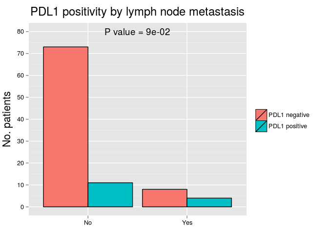 <table>
 <thead>
  <tr>
   <th style="text-align:left;">   </th>
   <th style="text-align:center;"> PDL1 negative </th>
   <th style="text-align:center;"> % </th>
   <th style="text-align:center;"> PDL1 positive </th>
   <th style="text-align:center;"> % </th>
  </tr>
 </thead>
<tbody>
  <tr>
   <td style="text-align:left;"> No </td>
   <td style="text-align:center;"> 73 </td>
   <td style="text-align:center;"> 90.1 </td>
   <td style="text-align:center;"> 11 </td>
   <td style="text-align:center;"> 73.3 </td>
  </tr>
  <tr>
   <td style="text-align:left;"> Yes </td>
   <td style="text-align:center;"> 8 </td>
   <td style="text-align:center;"> 9.9 </td>
   <td style="text-align:center;"> 4 </td>
   <td style="text-align:center;"> 26.7 </td>
  </tr>
</tbody>
</table>

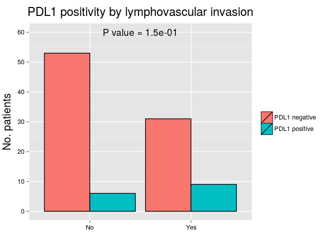 <table>
 <thead>
  <tr>
   <th style="text-align:left;">   </th>
   <th style="text-align:center;"> PDL1 negative </th>
   <th style="text-align:center;"> % </th>
   <th style="text-align:center;"> PDL1 positive </th>
   <th style="text-align:center;"> % </th>
  </tr>
 </thead>
<tbody>
  <tr>
   <td style="text-align:left;"> No </td>
   <td style="text-align:center;"> 53 </td>
   <td style="text-align:center;"> 63.1 </td>
   <td style="text-align:center;"> 6 </td>
   <td style="text-align:center;"> 40 </td>
  </tr>
  <tr>
   <td style="text-align:left;"> Yes </td>
   <td style="text-align:center;"> 31 </td>
   <td style="text-align:center;"> 36.9 </td>
   <td style="text-align:center;"> 9 </td>
   <td style="text-align:center;"> 60 </td>
  </tr>
</tbody>
</table>

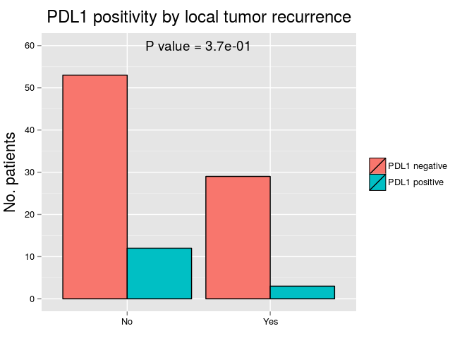 <table>
 <thead>
  <tr>
   <th style="text-align:left;">   </th>
   <th style="text-align:center;"> PDL1 negative </th>
   <th style="text-align:center;"> % </th>
   <th style="text-align:center;"> PDL1 positive </th>
   <th style="text-align:center;"> % </th>
  </tr>
 </thead>
<tbody>
  <tr>
   <td style="text-align:left;"> No </td>
   <td style="text-align:center;"> 53 </td>
   <td style="text-align:center;"> 64.6 </td>
   <td style="text-align:center;"> 12 </td>
   <td style="text-align:center;"> 80 </td>
  </tr>
  <tr>
   <td style="text-align:left;"> Yes </td>
   <td style="text-align:center;"> 29 </td>
   <td style="text-align:center;"> 35.4 </td>
   <td style="text-align:center;"> 3 </td>
   <td style="text-align:center;"> 20 </td>
  </tr>
</tbody>
</table>

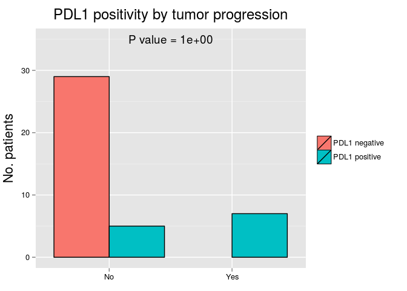 <table>
 <thead>
  <tr>
   <th style="text-align:left;">   </th>
   <th style="text-align:center;"> PDL1 negative </th>
   <th style="text-align:center;"> % </th>
   <th style="text-align:center;"> PDL1 positive </th>
   <th style="text-align:center;"> % </th>
  </tr>
 </thead>
<tbody>
  <tr>
   <td style="text-align:left;"> No </td>
   <td style="text-align:center;"> 29 </td>
   <td style="text-align:center;"> 40.8 </td>
   <td style="text-align:center;"> 5 </td>
   <td style="text-align:center;"> 41.7 </td>
  </tr>
  <tr>
   <td style="text-align:left;"> Yes </td>
   <td style="text-align:center;"> 42 </td>
   <td style="text-align:center;"> 59.2 </td>
   <td style="text-align:center;"> 7 </td>
   <td style="text-align:center;"> 58.3 </td>
  </tr>
</tbody>
</table>

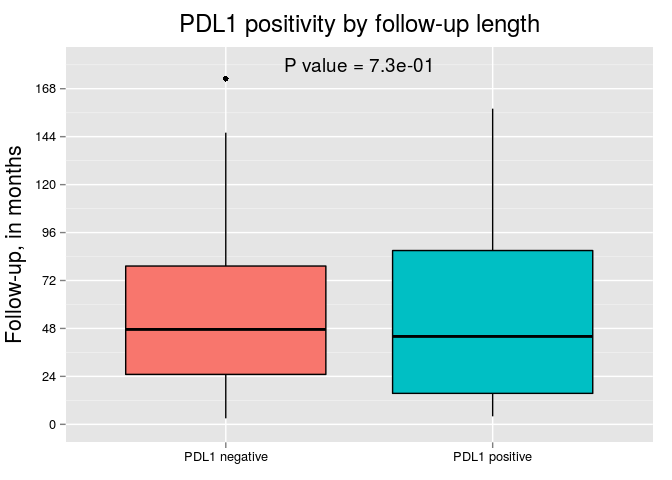 <table>
 <thead>
  <tr>
   <th style="text-align:left;">   </th>
   <th style="text-align:center;"> PDL1 negative </th>
   <th style="text-align:center;"> PDL1 positive </th>
  </tr>
 </thead>
<tbody>
  <tr>
   <td style="text-align:left;"> Mean </td>
   <td style="text-align:center;"> 55.3 </td>
   <td style="text-align:center;"> 51.9 </td>
  </tr>
  <tr>
   <td style="text-align:left;"> Standard Deviation </td>
   <td style="text-align:center;"> 39.6 </td>
   <td style="text-align:center;"> 43.2 </td>
  </tr>
  <tr>
   <td style="text-align:left;"> Median </td>
   <td style="text-align:center;"> 47.5 </td>
   <td style="text-align:center;"> 44.0 </td>
  </tr>
  <tr>
   <td style="text-align:left;"> Interquartile Range </td>
   <td style="text-align:center;"> 54.2 </td>
   <td style="text-align:center;"> 71.5 </td>
  </tr>
  <tr>
   <td style="text-align:left;"> Minimum </td>
   <td style="text-align:center;"> 3.0 </td>
   <td style="text-align:center;"> 4.0 </td>
  </tr>
  <tr>
   <td style="text-align:left;"> Maximum </td>
   <td style="text-align:center;"> 173.0 </td>
   <td style="text-align:center;"> 158.0 </td>
  </tr>
</tbody>
</table>

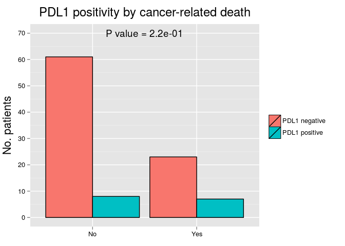 <table>
 <thead>
  <tr>
   <th style="text-align:left;">   </th>
   <th style="text-align:center;"> PDL1 negative </th>
   <th style="text-align:center;"> % </th>
   <th style="text-align:center;"> PDL1 positive </th>
   <th style="text-align:center;"> % </th>
  </tr>
 </thead>
<tbody>
  <tr>
   <td style="text-align:left;"> No </td>
   <td style="text-align:center;"> 61 </td>
   <td style="text-align:center;"> 72.6 </td>
   <td style="text-align:center;"> 8 </td>
   <td style="text-align:center;"> 53.3 </td>
  </tr>
  <tr>
   <td style="text-align:left;"> Yes </td>
   <td style="text-align:center;"> 23 </td>
   <td style="text-align:center;"> 27.4 </td>
   <td style="text-align:center;"> 7 </td>
   <td style="text-align:center;"> 46.7 </td>
  </tr>
</tbody>
</table>

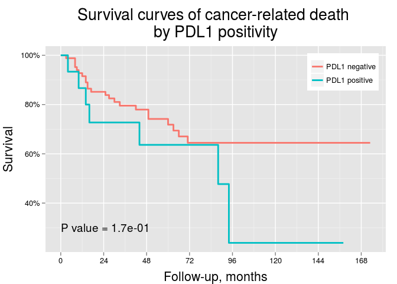 

# Odds ratios for local tumor recurrence
<table>
 <thead>
  <tr>
   <th style="text-align:left;"> Variables </th>
   <th style="text-align:center;"> OR </th>
   <th style="text-align:center;"> Lower 95% CI </th>
   <th style="text-align:center;"> Higher 95% CI </th>
   <th style="text-align:center;"> P value </th>
  </tr>
 </thead>
<tbody>
  <tr>
   <td style="text-align:left;"> Patient's sex </td>
   <td style="text-align:center;"> 1.45 </td>
   <td style="text-align:center;"> 0.60 </td>
   <td style="text-align:center;"> 3.66 </td>
   <td style="text-align:center;"> 0.42 </td>
  </tr>
  <tr>
   <td style="text-align:left;"> Patient's age group </td>
   <td style="text-align:center;"> 0.97 </td>
   <td style="text-align:center;"> 0.41 </td>
   <td style="text-align:center;"> 2.30 </td>
   <td style="text-align:center;"> 0.95 </td>
  </tr>
  <tr>
   <td style="text-align:left;"> Tumor location (pelvis vs ureter) </td>
   <td style="text-align:center;"> 1.16 </td>
   <td style="text-align:center;"> 0.48 </td>
   <td style="text-align:center;"> 2.82 </td>
   <td style="text-align:center;"> 0.74 </td>
  </tr>
  <tr>
   <td style="text-align:left;"> High pT (&gt;pT2) stage </td>
   <td style="text-align:center;"> 23.15 </td>
   <td style="text-align:center;"> 6.25 </td>
   <td style="text-align:center;"> 150.95 </td>
   <td style="text-align:center;"> 4.8e-05 </td>
  </tr>
  <tr>
   <td style="text-align:left;"> High histologic grade </td>
   <td style="text-align:center;"> 7.38 </td>
   <td style="text-align:center;"> 1.38 </td>
   <td style="text-align:center;"> 137.08 </td>
   <td style="text-align:center;"> 0.059 </td>
  </tr>
  <tr>
   <td style="text-align:left;"> Lymph node metastasis </td>
   <td style="text-align:center;"> 3.71 </td>
   <td style="text-align:center;"> 1.08 </td>
   <td style="text-align:center;"> 13.69 </td>
   <td style="text-align:center;"> 0.039 </td>
  </tr>
  <tr>
   <td style="text-align:left;"> Lymphovascular invasion </td>
   <td style="text-align:center;"> 7.79 </td>
   <td style="text-align:center;"> 3.06 </td>
   <td style="text-align:center;"> 21.66 </td>
   <td style="text-align:center;"> 3.4e-05 </td>
  </tr>
  <tr>
   <td style="text-align:left;"> PDL1 positivity </td>
   <td style="text-align:center;"> 2.32 </td>
   <td style="text-align:center;"> 0.74 </td>
   <td style="text-align:center;"> 7.20 </td>
   <td style="text-align:center;"> 0.14 </td>
  </tr>
</tbody>
</table>

# Odds ratios for tumor progression
<table>
 <thead>
  <tr>
   <th style="text-align:left;"> Variables </th>
   <th style="text-align:center;"> OR </th>
   <th style="text-align:center;"> Lower 95% CI </th>
   <th style="text-align:center;"> Higher 95% CI </th>
   <th style="text-align:center;"> P value </th>
  </tr>
 </thead>
<tbody>
  <tr>
   <td style="text-align:left;"> Patient's sex </td>
   <td style="text-align:center;"> 0.83 </td>
   <td style="text-align:center;"> 0.33 </td>
   <td style="text-align:center;"> 2.01 </td>
   <td style="text-align:center;"> 0.67 </td>
  </tr>
  <tr>
   <td style="text-align:left;"> Patient's age group </td>
   <td style="text-align:center;"> 0.50 </td>
   <td style="text-align:center;"> 0.20 </td>
   <td style="text-align:center;"> 1.22 </td>
   <td style="text-align:center;"> 0.13 </td>
  </tr>
  <tr>
   <td style="text-align:left;"> Tumor location (pelvis vs ureter) </td>
   <td style="text-align:center;"> 1.14 </td>
   <td style="text-align:center;"> 0.47 </td>
   <td style="text-align:center;"> 2.76 </td>
   <td style="text-align:center;"> 0.78 </td>
  </tr>
  <tr>
   <td style="text-align:left;"> High pT (&gt;pT2) stage </td>
   <td style="text-align:center;"> 5.23 </td>
   <td style="text-align:center;"> 2.07 </td>
   <td style="text-align:center;"> 13.97 </td>
   <td style="text-align:center;"> 0.00064 </td>
  </tr>
  <tr>
   <td style="text-align:left;"> High histologic grade </td>
   <td style="text-align:center;"> 3e+08 </td>
   <td style="text-align:center;"> 9.7e-40 </td>
   <td style="text-align:center;"> NA </td>
   <td style="text-align:center;"> 0.99 </td>
  </tr>
  <tr>
   <td style="text-align:left;"> Lymph node metastasis </td>
   <td style="text-align:center;"> 3.12 </td>
   <td style="text-align:center;"> 0.72 </td>
   <td style="text-align:center;"> 21.65 </td>
   <td style="text-align:center;"> 0.17 </td>
  </tr>
  <tr>
   <td style="text-align:left;"> Lymphovascular invasion </td>
   <td style="text-align:center;"> 3.99 </td>
   <td style="text-align:center;"> 1.56 </td>
   <td style="text-align:center;"> 11.06 </td>
   <td style="text-align:center;"> 0.0053 </td>
  </tr>
  <tr>
   <td style="text-align:left;"> PDL1 positivity </td>
   <td style="text-align:center;"> 0.97 </td>
   <td style="text-align:center;"> 0.28 </td>
   <td style="text-align:center;"> 3.54 </td>
   <td style="text-align:center;"> 0.96 </td>
  </tr>
</tbody>
</table>

# Odds ratios for cancer-related death
<table>
 <thead>
  <tr>
   <th style="text-align:left;"> Variables </th>
   <th style="text-align:center;"> OR </th>
   <th style="text-align:center;"> Lower 95% CI </th>
   <th style="text-align:center;"> Higher 95% CI </th>
   <th style="text-align:center;"> P value </th>
  </tr>
 </thead>
<tbody>
  <tr>
   <td style="text-align:left;"> Patient's sex </td>
   <td style="text-align:center;"> 1.45 </td>
   <td style="text-align:center;"> 0.60 </td>
   <td style="text-align:center;"> 3.66 </td>
   <td style="text-align:center;"> 0.42 </td>
  </tr>
  <tr>
   <td style="text-align:left;"> Patient's age group </td>
   <td style="text-align:center;"> 0.97 </td>
   <td style="text-align:center;"> 0.41 </td>
   <td style="text-align:center;"> 2.30 </td>
   <td style="text-align:center;"> 0.95 </td>
  </tr>
  <tr>
   <td style="text-align:left;"> Tumor location (pelvis vs ureter) </td>
   <td style="text-align:center;"> 1.16 </td>
   <td style="text-align:center;"> 0.48 </td>
   <td style="text-align:center;"> 2.82 </td>
   <td style="text-align:center;"> 0.74 </td>
  </tr>
  <tr>
   <td style="text-align:left;"> High pT (&gt;pT2) stage </td>
   <td style="text-align:center;"> 23.15 </td>
   <td style="text-align:center;"> 6.25 </td>
   <td style="text-align:center;"> 150.95 </td>
   <td style="text-align:center;"> 4.8e-05 </td>
  </tr>
  <tr>
   <td style="text-align:left;"> High histologic grade </td>
   <td style="text-align:center;"> 7.38 </td>
   <td style="text-align:center;"> 1.38 </td>
   <td style="text-align:center;"> 137.08 </td>
   <td style="text-align:center;"> 0.059 </td>
  </tr>
  <tr>
   <td style="text-align:left;"> Lymph node metastasis </td>
   <td style="text-align:center;"> 3.71 </td>
   <td style="text-align:center;"> 1.08 </td>
   <td style="text-align:center;"> 13.69 </td>
   <td style="text-align:center;"> 0.039 </td>
  </tr>
  <tr>
   <td style="text-align:left;"> Lymphovascular invasion </td>
   <td style="text-align:center;"> 7.79 </td>
   <td style="text-align:center;"> 3.06 </td>
   <td style="text-align:center;"> 21.66 </td>
   <td style="text-align:center;"> 3.4e-05 </td>
  </tr>
  <tr>
   <td style="text-align:left;"> PDL1 positivity </td>
   <td style="text-align:center;"> 2.32 </td>
   <td style="text-align:center;"> 0.74 </td>
   <td style="text-align:center;"> 7.20 </td>
   <td style="text-align:center;"> 0.14 </td>
  </tr>
</tbody>
</table>

# Hazard ratios for cancer-related death
<table>
 <thead>
  <tr>
   <th style="text-align:left;"> Variables </th>
   <th style="text-align:center;"> HR </th>
   <th style="text-align:center;"> Lower 95% CI </th>
   <th style="text-align:center;"> Higher 95% CI </th>
   <th style="text-align:center;"> P value </th>
  </tr>
 </thead>
<tbody>
  <tr>
   <td style="text-align:left;"> Patient's sex </td>
   <td style="text-align:center;"> 1.33 </td>
   <td style="text-align:center;"> 0.75 </td>
   <td style="text-align:center;"> 0.62 </td>
   <td style="text-align:center;"> 0.45 </td>
  </tr>
  <tr>
   <td style="text-align:left;"> Patient's age group </td>
   <td style="text-align:center;"> 0.77 </td>
   <td style="text-align:center;"> 1.29 </td>
   <td style="text-align:center;"> 0.37 </td>
   <td style="text-align:center;"> 0.49 </td>
  </tr>
  <tr>
   <td style="text-align:left;"> Tumor location (pelvis vs ureter) </td>
   <td style="text-align:center;"> 1.21 </td>
   <td style="text-align:center;"> 0.82 </td>
   <td style="text-align:center;"> 0.58 </td>
   <td style="text-align:center;"> 0.6 </td>
  </tr>
  <tr>
   <td style="text-align:left;"> High pT (&gt;pT2) stage </td>
   <td style="text-align:center;"> 17.63 </td>
   <td style="text-align:center;"> 0.057 </td>
   <td style="text-align:center;"> 4.19 </td>
   <td style="text-align:center;"> 1.1e-08 </td>
  </tr>
  <tr>
   <td style="text-align:left;"> High histologic grade </td>
   <td style="text-align:center;"> 7.79 </td>
   <td style="text-align:center;"> 0.13 </td>
   <td style="text-align:center;"> 1.06 </td>
   <td style="text-align:center;"> 0.0045 </td>
  </tr>
  <tr>
   <td style="text-align:left;"> Lymph node metastasis </td>
   <td style="text-align:center;"> 2.76 </td>
   <td style="text-align:center;"> 0.36 </td>
   <td style="text-align:center;"> 1.18 </td>
   <td style="text-align:center;"> 0.033 </td>
  </tr>
  <tr>
   <td style="text-align:left;"> Lymphovascular invasion </td>
   <td style="text-align:center;"> 5.64 </td>
   <td style="text-align:center;"> 0.18 </td>
   <td style="text-align:center;"> 2.50 </td>
   <td style="text-align:center;"> 6.1e-06 </td>
  </tr>
  <tr>
   <td style="text-align:left;"> PDL1 positivity </td>
   <td style="text-align:center;"> 1.78 </td>
   <td style="text-align:center;"> 0.56 </td>
   <td style="text-align:center;"> 0.76 </td>
   <td style="text-align:center;"> 0.2 </td>
  </tr>
</tbody>
</table>

