# PDL1 positivity, median 5%

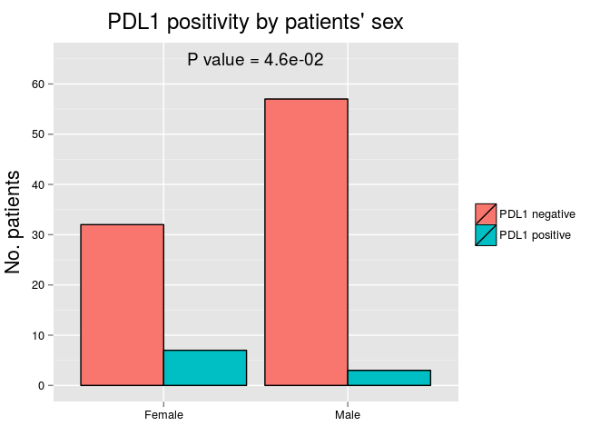 

|       | PDL1 negative | %  | PDL1 positive | %  |
|:------|:-------------:|:--:|:-------------:|:--:|
|Female |      32       | 36 |       7       | 70 |
|Male   |      57       | 64 |       3       | 30 |

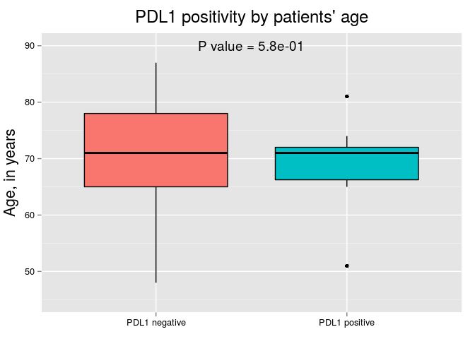 

|                    | PDL1 negative | PDL1 positive |
|:-------------------|:-------------:|:-------------:|
|Mean                |     70.1      |     69.0      |
|Standard Deviation  |      9.1      |      7.8      |
|Median              |     71.0      |     71.0      |
|Interquartile Range |     13.0      |      5.8      |
|Minimum             |     48.0      |     51.0      |
|Maximum             |     87.0      |     81.0      |

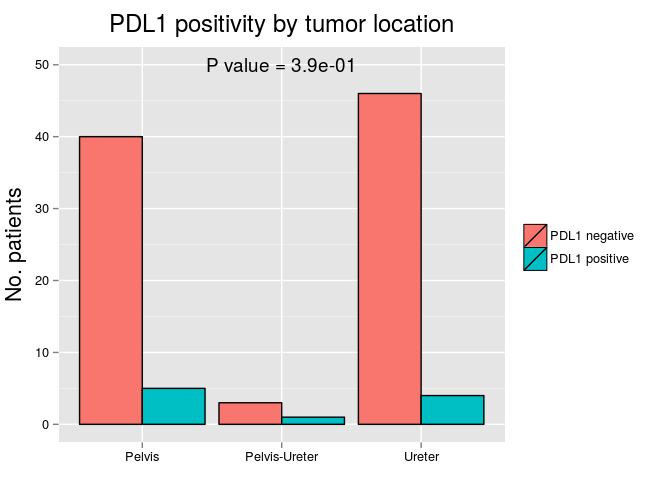 

|              | PDL1 negative |  %   | PDL1 positive | %  |
|:-------------|:-------------:|:----:|:-------------:|:--:|
|Pelvis        |      40       | 44.9 |       5       | 50 |
|Pelvis-Ureter |       3       | 3.4  |       1       | 10 |
|Ureter        |      46       | 51.7 |       4       | 40 |

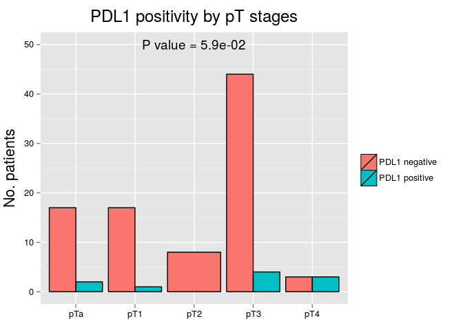 

|    | PDL1 negative |  %   | PDL1 positive | %  |
|:---|:-------------:|:----:|:-------------:|:--:|
|pTa |      17       | 19.1 |       2       | 20 |
|pT1 |      17       | 19.1 |       1       | 10 |
|pT2 |       8       | 9.0  |       0       | 0  |
|pT3 |      44       | 49.4 |       4       | 40 |
|pT4 |       3       | 3.4  |       3       | 30 |

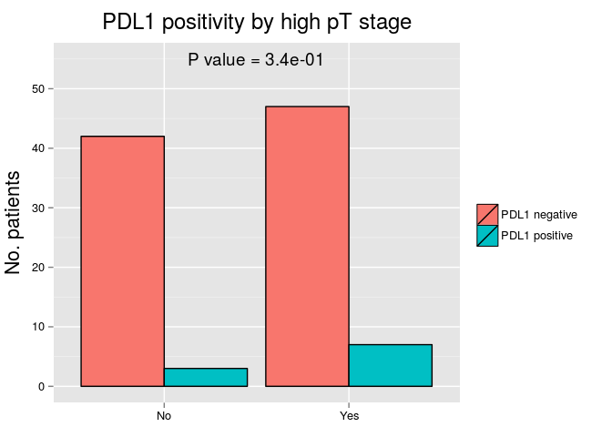 

|    | PDL1 negative |  %   | PDL1 positive | %  |
|:---|:-------------:|:----:|:-------------:|:--:|
|No  |      42       | 47.2 |       3       | 30 |
|Yes |      47       | 52.8 |       7       | 70 |

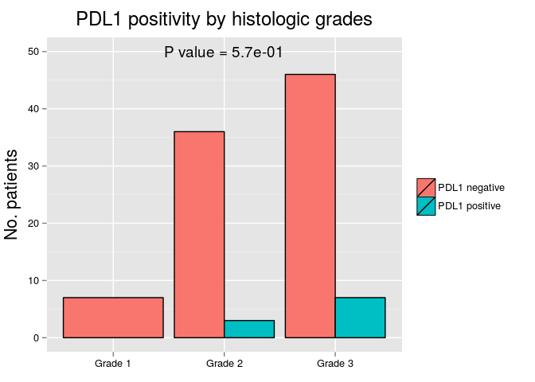 

|        | PDL1 negative |  %   | PDL1 positive | %  |
|:-------|:-------------:|:----:|:-------------:|:--:|
|Grade 1 |       7       | 7.9  |       0       | 0  |
|Grade 2 |      36       | 40.4 |       3       | 30 |
|Grade 3 |      46       | 51.7 |       7       | 70 |

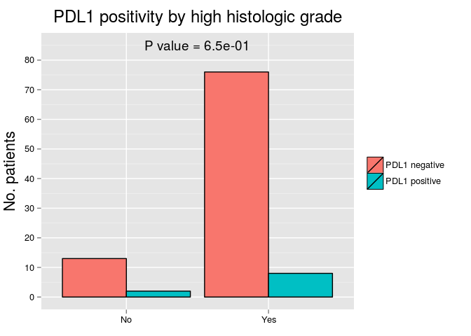 

|    | PDL1 negative |  %   | PDL1 positive | %  |
|:---|:-------------:|:----:|:-------------:|:--:|
|No  |      13       | 14.6 |       2       | 20 |
|Yes |      76       | 85.4 |       8       | 80 |

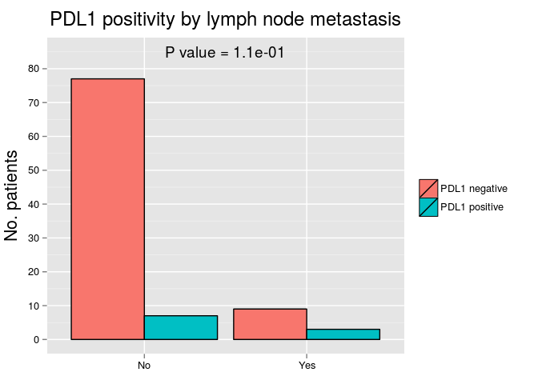 

|    | PDL1 negative |  %   | PDL1 positive | %  |
|:---|:-------------:|:----:|:-------------:|:--:|
|No  |      77       | 89.5 |       7       | 70 |
|Yes |       9       | 10.5 |       3       | 30 |

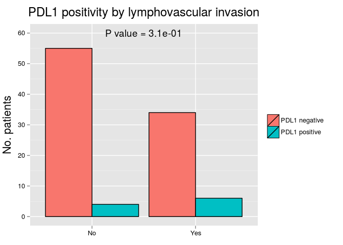 

|    | PDL1 negative |  %   | PDL1 positive | %  |
|:---|:-------------:|:----:|:-------------:|:--:|
|No  |      55       | 61.8 |       4       | 40 |
|Yes |      34       | 38.2 |       6       | 60 |

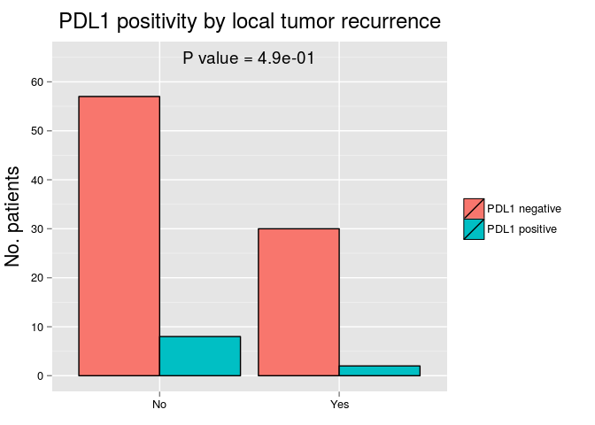 

|    | PDL1 negative |  %   | PDL1 positive | %  |
|:---|:-------------:|:----:|:-------------:|:--:|
|No  |      57       | 65.5 |       8       | 80 |
|Yes |      30       | 34.5 |       2       | 20 |

 

|    | PDL1 negative |  %   | PDL1 positive |  %   |
|:---|:-------------:|:----:|:-------------:|:----:|
|No  |      31       | 41.3 |       3       | 37.5 |
|Yes |      44       | 58.7 |       5       | 62.5 |

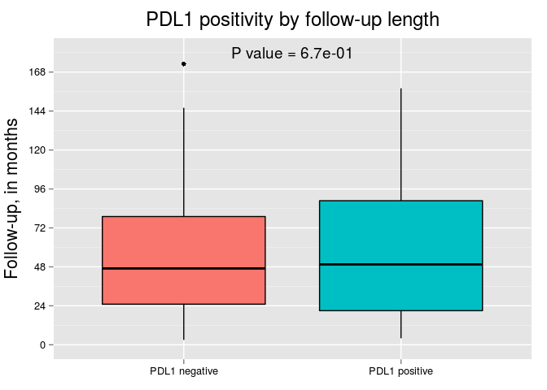 

|                    | PDL1 negative | PDL1 positive |
|:-------------------|:-------------:|:-------------:|
|Mean                |     54.2      |     59.9      |
|Standard Deviation  |     39.3      |     47.5      |
|Median              |     47.0      |     49.5      |
|Interquartile Range |     54.0      |     67.8      |
|Minimum             |      3.0      |      4.0      |
|Maximum             |     173.0     |     158.0     |

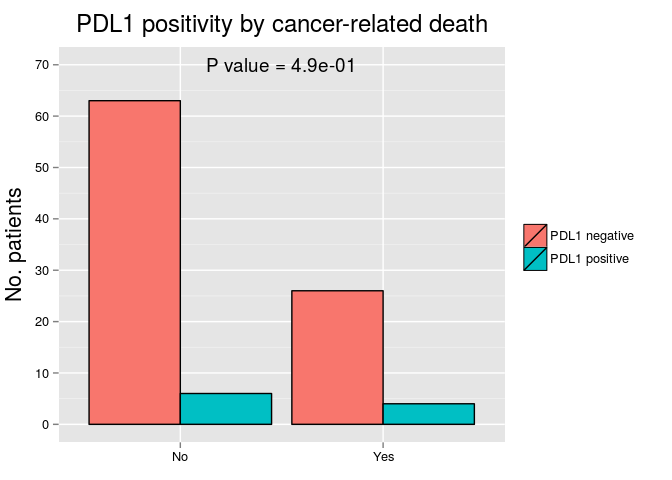 

|    | PDL1 negative |  %   | PDL1 positive | %  |
|:---|:-------------:|:----:|:-------------:|:--:|
|No  |      63       | 70.8 |       6       | 60 |
|Yes |      26       | 29.2 |       4       | 40 |

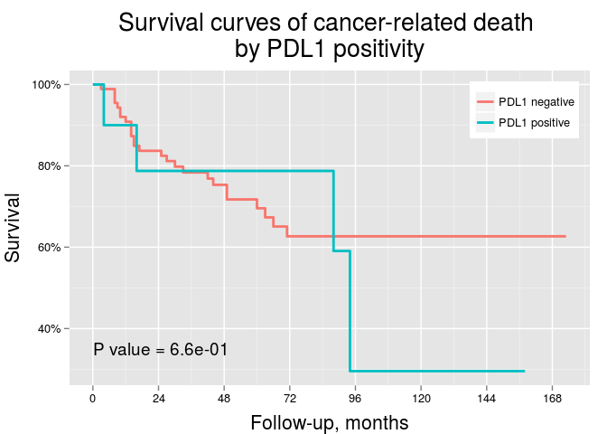 

# Odds ratios for local tumor recurrence

|Variables                         |  OR   | Lower 95% CI | Higher 95% CI | P value |
|:---------------------------------|:-----:|:------------:|:-------------:|:-------:|
|Patient's sex                     | 1.45  |     0.60     |     3.66      |  0.42   |
|Patient's age group               | 0.97  |     0.41     |     2.30      |  0.95   |
|Tumor location (pelvis vs ureter) | 1.16  |     0.48     |     2.82      |  0.74   |
|High pT (>pT2) stage              | 23.15 |     6.25     |    150.95     | 4.8e-05 |
|High histologic grade             | 7.38  |     1.38     |    137.08     |  0.059  |
|Lymph node metastasis             | 3.71  |     1.08     |     13.69     |  0.039  |
|Lymphovascular invasion           | 7.79  |     3.06     |     21.66     | 3.4e-05 |
|PDL1 positivity                   | 1.62  |     0.39     |     6.13      |  0.48   |

# Odds ratios for tumor progression

|Variables                         |  OR   | Lower 95% CI | Higher 95% CI | P value |
|:---------------------------------|:-----:|:------------:|:-------------:|:-------:|
|Patient's sex                     | 0.83  |     0.33     |     2.01      |  0.67   |
|Patient's age group               | 0.50  |     0.20     |     1.22      |  0.13   |
|Tumor location (pelvis vs ureter) | 1.14  |     0.47     |     2.76      |  0.78   |
|High pT (>pT2) stage              | 5.23  |     2.07     |     13.97     | 0.00064 |
|High histologic grade             | 3e+08 |   9.7e-40    |      NA       |  0.99   |
|Lymph node metastasis             | 3.12  |     0.72     |     21.65     |  0.17   |
|Lymphovascular invasion           | 3.99  |     1.56     |     11.06     | 0.0053  |
|PDL1 positivity                   | 1.17  |     0.27     |     6.06      |  0.83   |

# Odds ratios for cancer-related death

|Variables                         |  OR   | Lower 95% CI | Higher 95% CI | P value |
|:---------------------------------|:-----:|:------------:|:-------------:|:-------:|
|Patient's sex                     | 1.45  |     0.60     |     3.66      |  0.42   |
|Patient's age group               | 0.97  |     0.41     |     2.30      |  0.95   |
|Tumor location (pelvis vs ureter) | 1.16  |     0.48     |     2.82      |  0.74   |
|High pT (>pT2) stage              | 23.15 |     6.25     |    150.95     | 4.8e-05 |
|High histologic grade             | 7.38  |     1.38     |    137.08     |  0.059  |
|Lymph node metastasis             | 3.71  |     1.08     |     13.69     |  0.039  |
|Lymphovascular invasion           | 7.79  |     3.06     |     21.66     | 3.4e-05 |
|PDL1 positivity                   | 1.62  |     0.39     |     6.13      |  0.48   |

# Hazard ratios for cancer-related death

|Variables                         |  HR   | Lower 95% CI | Higher 95% CI | P value |
|:---------------------------------|:-----:|:------------:|:-------------:|:-------:|
|Patient's sex                     | 1.33  |     0.75     |     0.62      |  0.45   |
|Patient's age group               | 0.77  |     1.29     |     0.37      |  0.49   |
|Tumor location (pelvis vs ureter) | 1.21  |     0.82     |     0.58      |   0.6   |
|High pT (>pT2) stage              | 17.63 |    0.057     |     4.19      | 1.1e-08 |
|High histologic grade             | 7.79  |     0.13     |     1.06      | 0.0045  |
|Lymph node metastasis             | 2.76  |     0.36     |     1.18      |  0.033  |
|Lymphovascular invasion           | 5.64  |     0.18     |     2.50      | 6.1e-06 |
|PDL1 positivity                   | 1.26  |     0.79     |     0.44      |  0.68   |

