# PDL1 expression in tumor cells of upper tract urothelial carcinoma

 

|       | No. Cases | %  |
|:------|:---------:|:--:|
|Female |    39     | 39 |
|Male   |    60     | 61 |

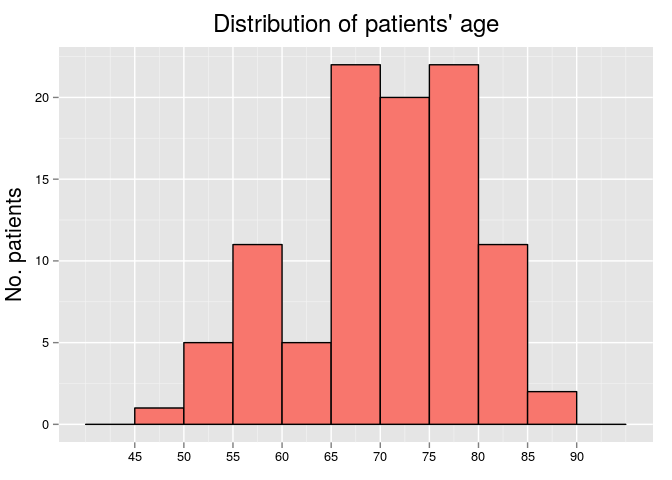 

|Statistics          | Values |
|:-------------------|:------:|
|Mean                |   70   |
|Standard Deviation  |  8.9   |
|Median              |   71   |
|Interquartile Range |  11.5  |
|Mininum             |   48   |
|Maximum             |   87   |

 

|              | No. Cases | %  |
|:-------------|:---------:|:--:|
|Pelvis        |    45     | 45 |
|Pelvis-Ureter |     4     | 4  |
|Ureter        |    50     | 51 |

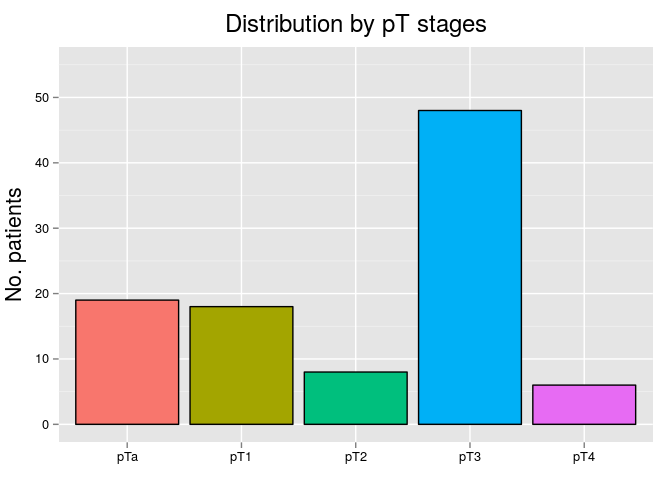 

|    | No. Cases |  %   |
|:---|:---------:|:----:|
|pTa |    19     | 19.2 |
|pT1 |    18     | 18.2 |
|pT2 |     8     | 8.1  |
|pT3 |    48     | 48.5 |
|pT4 |     6     | 6.1  |

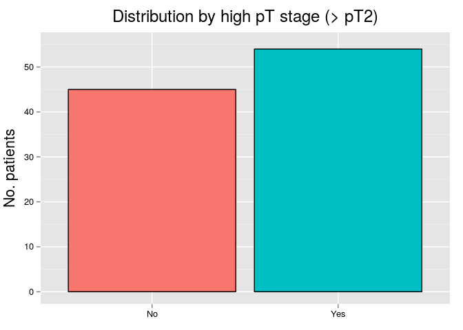 

|    | No. Cases | %  |
|:---|:---------:|:--:|
|No  |    45     | 45 |
|Yes |    54     | 55 |

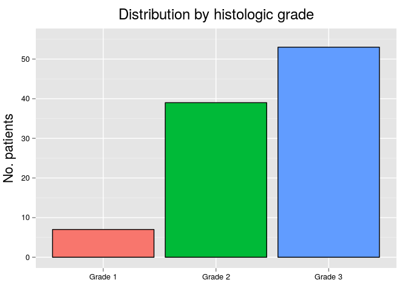 

|        | No. Cases |  %   |
|:-------|:---------:|:----:|
|Grade 1 |     7     | 7.1  |
|Grade 2 |    39     | 39.4 |
|Grade 3 |    53     | 53.5 |

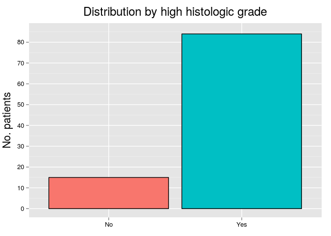 

|    | No. Cases | %  |
|:---|:---------:|:--:|
|No  |    15     | 15 |
|Yes |    84     | 85 |

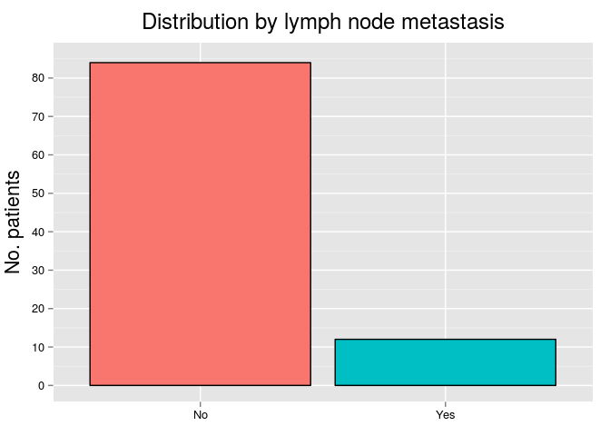 

|    | No. Cases | %  |
|:---|:---------:|:--:|
|No  |    84     | 88 |
|Yes |    12     | 12 |

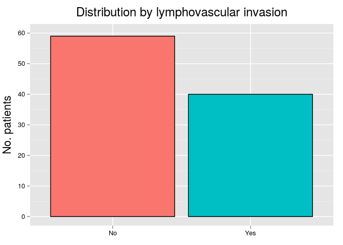 

|    | No. Cases | %  |
|:---|:---------:|:--:|
|No  |    59     | 60 |
|Yes |    40     | 40 |

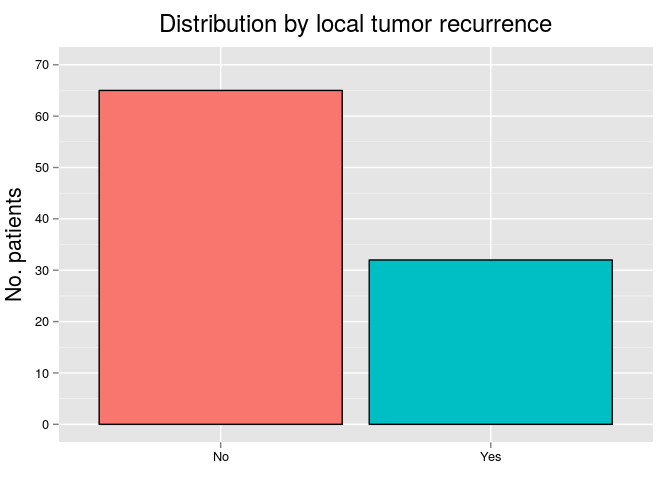 

|    | No. Cases | %  |
|:---|:---------:|:--:|
|No  |    65     | 67 |
|Yes |    32     | 33 |

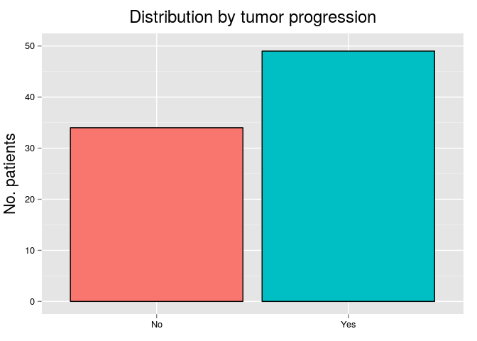 

|    | No. Cases | %  |
|:---|:---------:|:--:|
|No  |    34     | 41 |
|Yes |    49     | 59 |

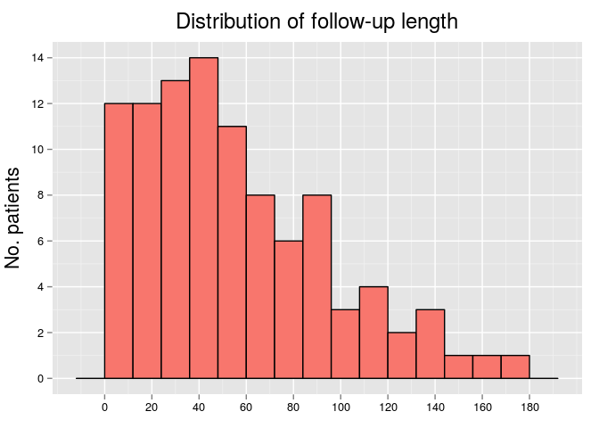 

|Statistics          | Values |
|:-------------------|:------:|
|Mean                |  54.8  |
|Standard Deviation  |  39.9  |
|Median              |   47   |
|Interquartile Range |  56.5  |
|Mininum             |   3    |
|Maximum             |  173   |

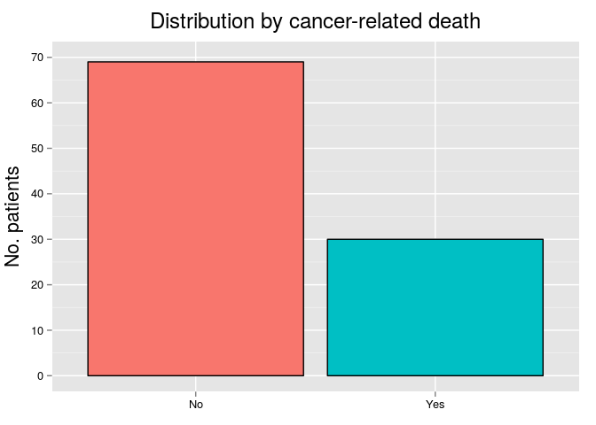 

|    | No. Cases | %  |
|:---|:---------:|:--:|
|No  |    69     | 70 |
|Yes |    30     | 30 |

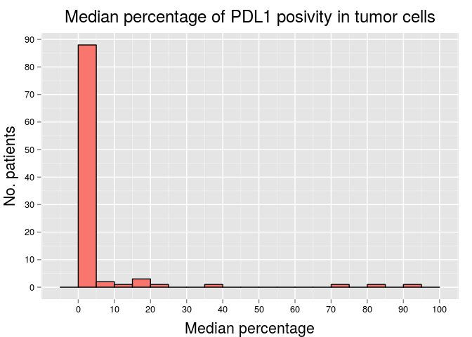 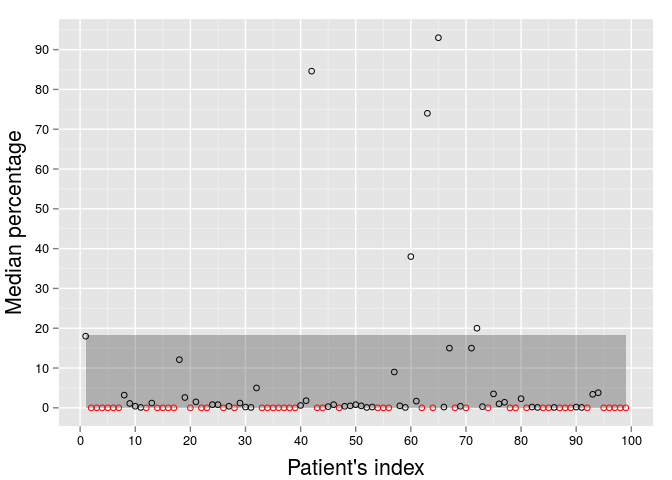 

|Statistics          | Values |
|:-------------------|:------:|
|Mean                |  4.3   |
|Standard Deviation  |  15.1  |
|Median              |  0.1   |
|Interquartile Range |  0.9   |
|Mininum             |   0    |
|Maximum             |   93   |

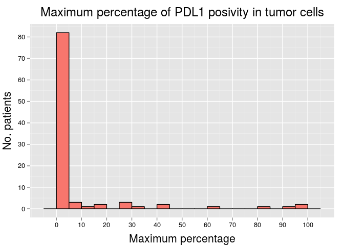 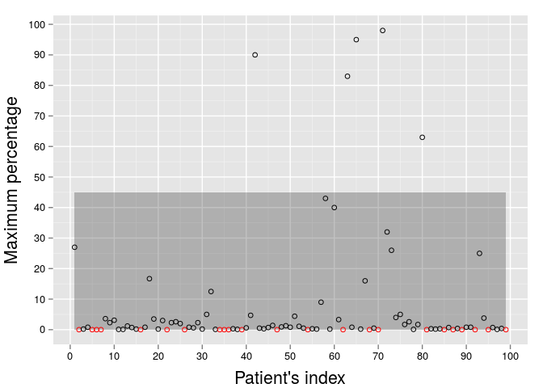 

|Statistics          | Values |
|:-------------------|:------:|
|Mean                |  7.7   |
|Standard Deviation  |   20   |
|Median              |  0.7   |
|Interquartile Range |  2.9   |
|Mininum             |   0    |
|Maximum             |   98   |

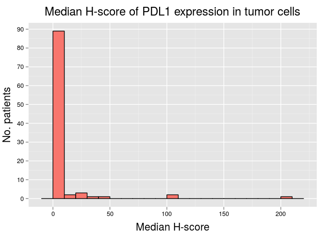  

|Statistics          | Values |
|:-------------------|:------:|
|Mean                |  6.3   |
|Standard Deviation  |  25.4  |
|Median              |  0.1   |
|Interquartile Range |  0.9   |
|Mininum             |   0    |
|Maximum             |  203   |

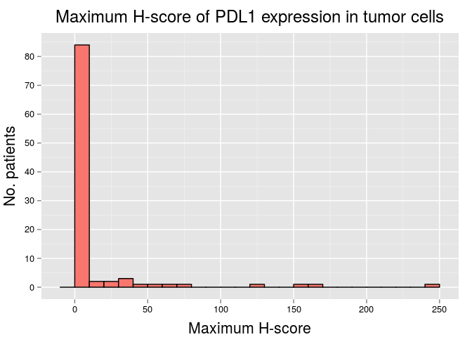 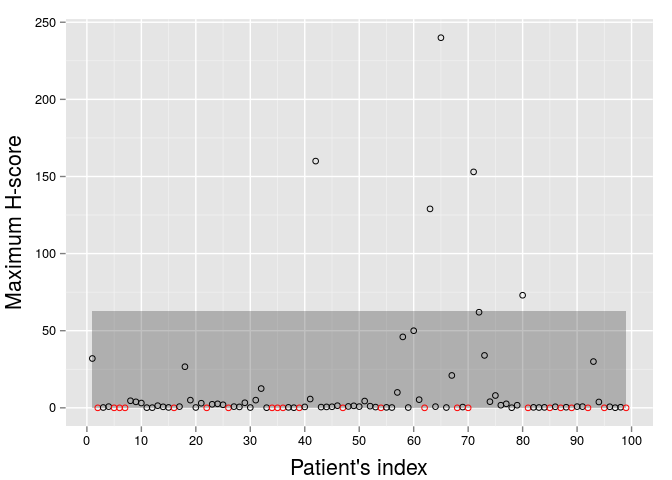 

|Statistics          | Values |
|:-------------------|:------:|
|Mean                |  11.9  |
|Standard Deviation  |  36.1  |
|Median              |  0.7   |
|Interquartile Range |  3.4   |
|Mininum             |   0    |
|Maximum             |  240   |

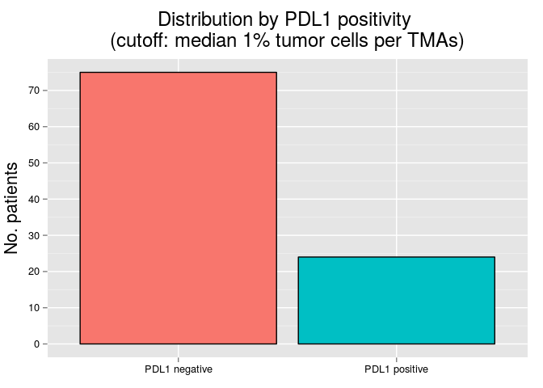 

|              | No. Cases | %  |
|:-------------|:---------:|:--:|
|PDL1 negative |    75     | 76 |
|PDL1 positive |    24     | 24 |

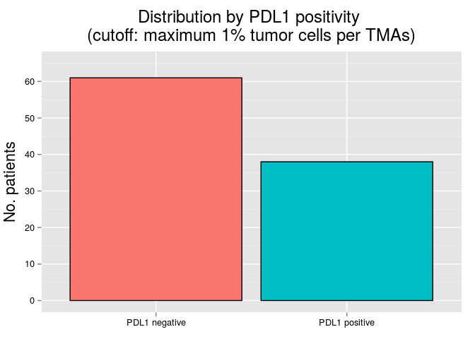 

|              | No. Cases | %  |
|:-------------|:---------:|:--:|
|PDL1 negative |    61     | 62 |
|PDL1 positive |    38     | 38 |

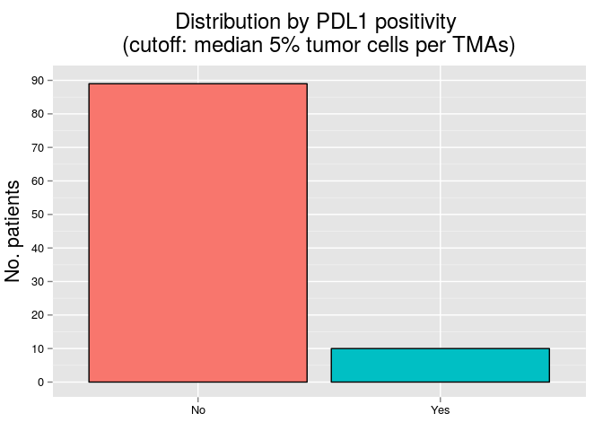 

|              | No. Cases | %  |
|:-------------|:---------:|:--:|
|PDL1 negative |    89     | 90 |
|PDL1 positive |    10     | 10 |

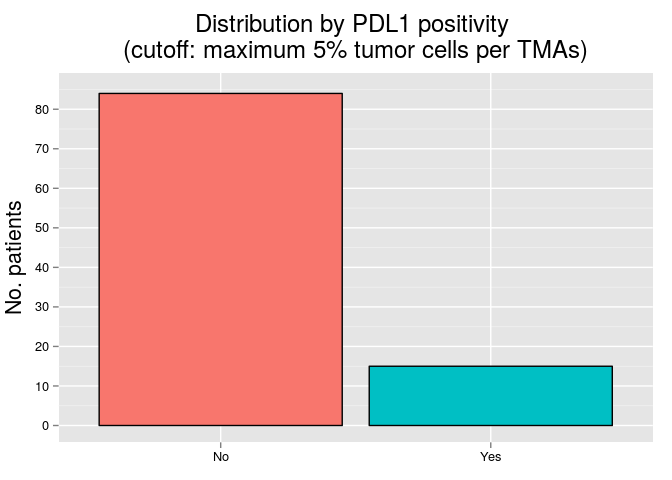 

|              | No. Cases | %  |
|:-------------|:---------:|:--:|
|PDL1 negative |    84     | 85 |
|PDL1 positive |    15     | 15 |

